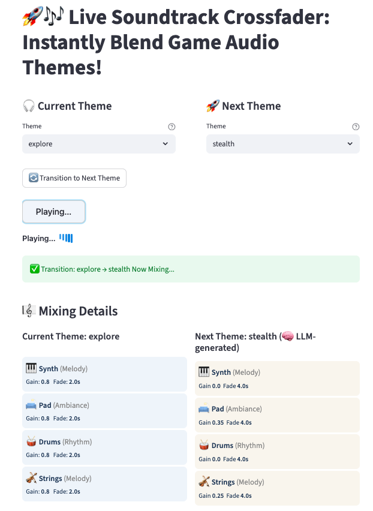
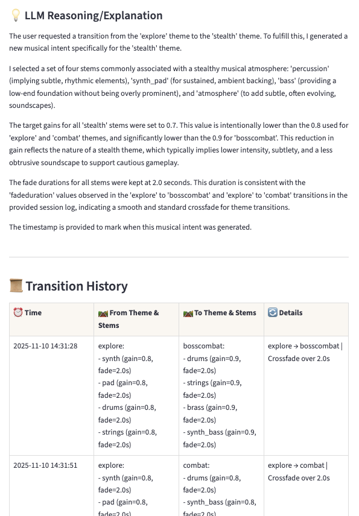

# 🚀🎶 Game Sound Generator: Live Theme StemMix Demo

**AI-powered, cross-platform game audio mixing—mix themes, fade stems, and explore transitions in REAL time!**

***

## 🌟 Features

- **Live Audio Stem Crossfade:** Instantly transition and blend music themes using multi-stem mixing with smooth gain and fade control.
- **Smart AI Transitions:** All musical intent—stems, gains, fades—generated on the fly by Gemini LLM (Google AI).
- **Interactive Dashboard:** Streamlit UI for selecting themes, exploring mixes, and tracking history.
- **React + Howler.js Frontend:** Native, multi-track audio mixing, animated “Playing…” soundwave indicator.
- **Session History:** Logs each transition, stem info, and AI reasoning for transparency and replay.
- **Robust Error Handling:** Friendly warnings and feedback when model or audio fails.

***

## 🧠✨ Gemini LLM Powers Musical Intelligence

**Gemini LLM isn’t just a backend—it’s the music director!**

- Given your themes, history, and session state, Gemini outputs a full musical “intent”:  
  - Which stems to use  
  - Gain and fade levels  
  - Explanation/reasoning
- This intent is fed directly to Howler.js—so *every mix you hear is AI-designed and explained!*

***

## 🏗️ Architecture: AI → Python → JS → Real Audio

| Layer       | Technology    | Role                                                      |
|-------------|--------------|-----------------------------------------------------------|
| **Python**  | Streamlit    | 🖼️ User interface, theme logic, LLM request/response      |
| **AI**      | Gemini LLM   | 🧠 Generates JSON intent: which stems, gain, fade durations|
| **Bridge**  | Streamlit Component API | 🔗 Passes intent from Python/AI to JS frontend     |
| **Frontend**| React + Howler.js | 🎶 Audio mixing, playback, and animated feedback      |

**How it Works:**

1. User picks “Current” and “Next” theme in Streamlit UI (demo2_st.py).
2. Python code sends current session context to Gemini LLM (llm_advisor.py).
3. LLM replies with musical intent (JSON): which stems, gain/fade, explanation.
4. Python passes intent to the React/Howler.js custom component via `stem_mixer.py`.
5. React mixer parses stems, instantly fades out old stems and fades in new ones using Howler.js.
6. UI displays soundwave animation and tracks transition in session history.

***

## 📁 Project Structure

```plaintext
game_sound_generator/
├── demo2_st.py             # Streamlit UI: theme select, transitions, calls to LLM & mixer
├── llm_advisor.py          # Gemini/Google AI backend music intent generator
├── schemas.py              # Typed dataclasses for mix/session/stem intents
├── audio_clips/            # 🎼 All .wav stem files organized by theme
│   ├── all_music/ ...      # Stems for mixing
│   ├── bosscombat/ ...
│   └── ...                 # More themes and stems
├── my_component/
│   ├── stem_mixer.py       # Python<->JS bridge for React/Howler.js
│   └── frontend/
│       ├── MyComponent.tsx # React logic for mix transitions and audio playback
│       ├── index.tsx       # Entrypoint for mounting custom component
└── ...more                 # (setup, logs, tests, etc.)
```

***

## ⚡️ Quick Start

1. **Install Python requirements**
   ```bash
   pip install -r requirements.txt
   ```

2. **Configure LLM Credentials**
   - Create a `.env` file with:
     ```
     GOOGLE_API_KEY=your_api_key_here
     ```

3. **Build the React/Howler.js frontend**
   ```bash
   cd my_component/frontend
   npm install
   npm run build
   ```

4. **Launch the Streamlit Dashboard**
   ```bash
   streamlit run demo2_st.py
   ```

***

## 🧩 Component Highlights

- **demo2_st.py:** Main Streamlit workflow—UI, theme selection, transitions, session log.
- **llm_advisor.py:** Gemini LLM request/response handler—parses, validates, and explains the musical intent.
- **my_component/stem_mixer.py & frontend/:** High-fidelity JS/React mixer, powered by Howler.js, for all actual audio.

***

## 🎨 Screenshots

> 
> 

***

## 🤝 Credits

Powered by [Streamlit](https://streamlit.io), [Google Gemini](https://ai.google.com/gemini/), [Howler.js](https://howlerjs.com/).

***

## 📋 License

MIT. See LICENSE for details.

